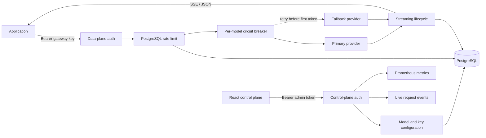

# HonoBox architecture

HonoBox keeps inference traffic and administrative traffic on separate trust paths while sharing PostgreSQL-backed configuration and request history.



## Request lifecycle

```mermaid
sequenceDiagram
  participant C as Client
  participant G as HonoBox
  participant P as Primary provider
  participant F as Fallback provider

  C->>G: POST /v1/chat/completions
  G->>G: authenticate + rate limit
  G->>G: check primary circuit
  G->>P: completion request + AbortSignal
  alt primary succeeds
    P-->>G: response / stream chunks
  else retryable failure before first chunk
    P-->>G: timeout, 429, or 5xx
    G->>G: record failure / possibly open circuit
    G->>F: retry once
    F-->>G: response / stream chunks
  else failure after first chunk
    P-->>G: stream interrupted
    G-->>C: error event; never mix providers
  end
  G-->>C: response
  G->>G: persist trace + update metrics
```

## Reliability boundaries

- Provider HTTP 408, 409, 425, 429 and 5xx responses are retryable. Authentication and validation failures are not.
- A streaming request may switch providers only before its first downstream chunk.
- Three retryable failures open a model circuit for 30 seconds. A single half-open probe decides recovery.
- Circuit state is process-local. PostgreSQL shares rate limits, configuration, and request traces, but multi-node circuit coordination remains future work.
- `/api/metrics` exposes Prometheus counters and latency histograms behind control-plane authentication.
